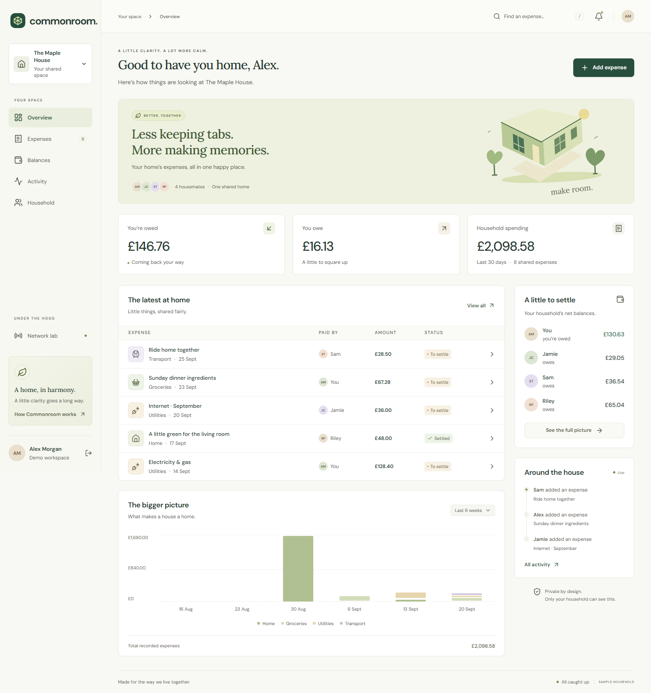
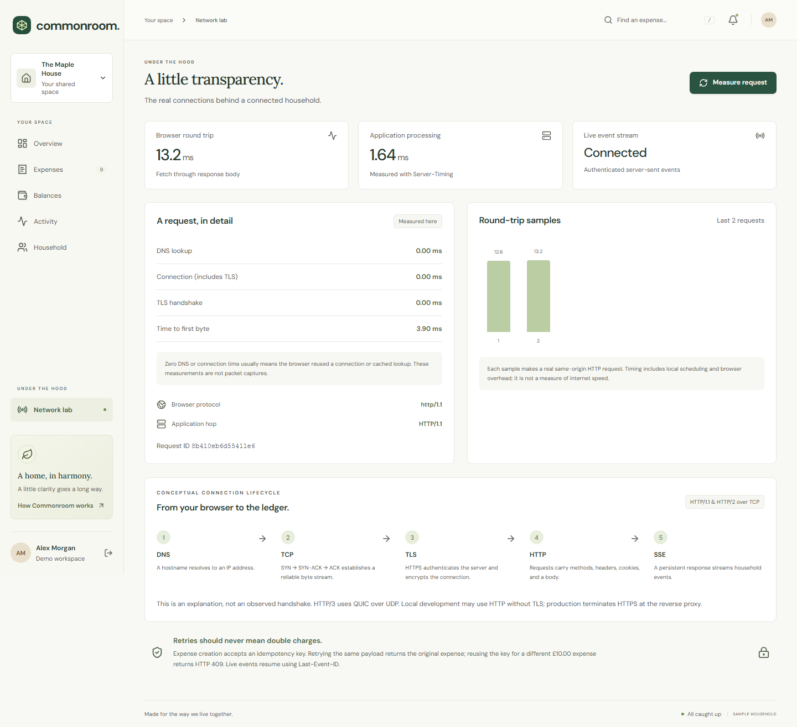
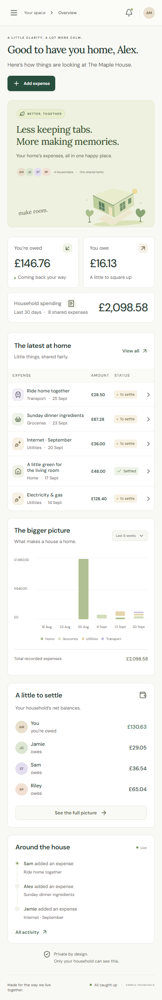

<div align="center">


# Commonroom

### Shared living. Settled.

A considered home for shared expenses.<br/>Exact-penny accounting, a verifiable audit trail, and a clear view of the connections underneath.

[](https://github.com/joshbeira/commonroom/actions/workflows/ci.yml)
[](LICENSE)


[Quick start](#quick-start) · [Architecture](docs/architecture.md) · [Security](SECURITY.md) · [Networking](docs/networking.md) · [API](docs/api.md)

</div>



## Why Commonroom?

Sharing a home should not mean maintaining a spreadsheet, chasing transfers, or wondering whether a bill was paid. Commonroom brings the household ledger, receipts, balances, and payment confirmations into one calm interface.

The engineering is deliberately visible: retry-safe writes, household-scoped authorization, persistent live updates, transactional accounting, and measured browser-to-server timing. A reviewer can explore an isolated sample household in a click, then inspect how it works.

## What it does

- **A shared ledger:** categorize expenses, search and filter, attach receipts, archive settled bills, and export to CSV.
- **Fair to the penny:** equal or weighted splits use integer arithmetic and deterministic largest-remainder allocation. A £10.01 bill split four ways always totals £10.01.
- **A two-step payment workflow:** a housemate records an external transfer; the original payer confirms or rejects it. Repeated requests do not apply the action twice.
- **A clearer balance:** see outstanding shares and a suggested set of net transfers. Suggestions are informational; the ledger records confirmations against original bills.
- **Everyone in the loop:** authenticated server-sent events update other open sessions, with resumable event IDs, heartbeats, reconnects, and connection limits.
- **A verifiable history:** household events form an HMAC-SHA256 chain. The activity page checks its integrity and shows its limitations.
- **An observable connection:** the network lab displays real Resource Timing, Server-Timing, protocol observations, and request IDs alongside an explanation of DNS, TCP, TLS, HTTP, and SSE.
- **A careful interface:** responsive layouts, keyboard navigation, native modal focus management, reduced-motion support, local fonts, and automated accessibility checks.

Commonroom tracks money paid **outside** the app. It does not process payments, connect to banks, or verify that a transfer happened.

## Quick start

### Docker

```sh
git clone https://github.com/joshbeira/commonroom.git
cd commonroom
docker compose up --build
```

Open **http://localhost:8000** and choose **Explore the demo**. Each demo session creates a separate household with synthetic data. The default Compose configuration is for local development and binds only to loopback.

### Run from source

Requires Python 3.10+, Node.js 22.12+, and pnpm 10.30.3. From the repository root:

```sh
python -m venv .venv
# macOS / Linux:
source .venv/bin/activate
# Windows PowerShell:
# .\.venv\Scripts\Activate.ps1

python -m pip install --upgrade pip
python -m pip install -r requirements.txt
python -m pip install -e ".[dev]"
cp .env.example .env
cd web
pnpm install --frozen-lockfile
pnpm build
cd ..
python -m server
```

On PowerShell, use `Copy-Item .env.example .env` in place of `cp` if preferred. Development keys are generated locally when the `.env` keys are blank. The database and keys are excluded from Git. To use real accounts, create an account and household, generate an invitation, then join from another account in a separate browser profile.

For hot reloading, keep the Python server running and run `pnpm dev` from `web/`. Open the Vite URL; its same-origin proxy forwards API requests to Flask.

## Engineering decisions

| Concern | Implementation | Why it matters |
| --- | --- | --- |
| Money | Integer pennies, allocation invariants, SQL constraints | No floating-point balance drift |
| Writes | `BEGIN IMMEDIATE`, atomic audit append, durable idempotency keys | Concurrent retries create one expense |
| Authentication | Scrypt password hashes, revocable 12-hour sessions, rotated CSRF tokens | A copied cookie stops working after logout |
| Authorization | Server-side household membership on every protected resource | Knowing another expense ID grants no access |
| Evidence | Decoded JPEG/PNG, size limits, re-encoding, metadata removal | Files are validated beyond their names or MIME types |
| Live updates | SSE + durable event cursor, 25-second streams, bounded leases | Missed events replay after reconnect; worker use is bounded |
| Audit | Per-household HMAC chain with a separate key | Detects altered entries and gaps in the chain |
| Networking | Caddy TLS termination, optional explicit proxy trust, HTTP metrics | Transport behavior is measured and documented |

SQLite in WAL mode is an intentional **single-host** choice. It provides a low-friction local setup and serialized financial writes. This is not a horizontally distributed system; scaling to many concurrent households would require database and event-delivery changes. See [tradeoffs and boundaries](docs/architecture.md#boundaries).

## Verification

```sh
# From the repository root, with the virtual environment active
python -m pytest
python -m ruff check server tests scripts
python -m pip_audit -r requirements.txt

cd web
pnpm build
pnpm format:check
pnpm exec playwright install chromium
pnpm test:e2e
pnpm audit --audit-level high
```

Backend tests exercise money conservation, tenant isolation, session revocation, CSRF, rate limiting, invitation expiry, password reset, image validation, audit tampering, SSE replay, and concurrent retries. Browser tests cover complete user flows, mobile layouts, and axe accessibility checks. Browser tests launch their own server with a fresh temporary database on port 8001.

GitHub Actions runs the Python suite, builds the frontend, runs Chromium tests, audits dependencies, and builds and smoke-tests the Docker image. Accessibility scans are useful checks, not a claim of comprehensive WCAG conformance.

## A look underneath



The network lab reports what the browser and application can actually observe. It does not invent packet-level measurements. Zero DNS/TCP timings can mean connection reuse or cached lookup; HTTP/3 uses QUIC over UDP. The [networking guide](docs/networking.md) explains the distinction and includes reproducible inspection commands.

<details>
<summary>Mobile preview</summary>



</details>

## Project layout

```text
server/              Flask application, security, accounting, API, demo data
  migrations/        Versioned SQL migrations
web/
  src/               React + strict TypeScript interface
  public/            Local fonts, font licenses, brand asset
  tests/             Playwright journeys and accessibility checks
tests/               Python domain, integration, and security tests
scripts/             Isolated browser-test server and backup utility
deploy/              Caddy and production Compose configuration
docs/                Architecture, API, networking, deployment, screenshots
.github/             CI, dependency updates, issue and PR templates
```

## Deployment & contributing

Read the [deployment guide](docs/deployment.md) before exposing an instance. Production requires independent keys, an HTTPS origin, explicit trusted hosts, disabled demo mode, and a private application port. SMTP-based account recovery is optional and uses STARTTLS.

Contributions are welcome; see [CONTRIBUTING.md](CONTRIBUTING.md). Report vulnerabilities through the process in [SECURITY.md](SECURITY.md).

## Credits

Built with [Flask](https://flask.palletsprojects.com/), [React](https://react.dev/), [TypeScript](https://www.typescriptlang.org/), [Vite](https://vite.dev/), [SQLite](https://sqlite.org/), [Pillow](https://python-pillow.github.io/), [Lucide](https://lucide.dev/), [Playwright](https://playwright.dev/), and [axe-core](https://github.com/dequelabs/axe-core). DM Sans and Lora are bundled under their SIL Open Font Licenses in `web/public/fonts/`. The house illustration is an original SVG component.

[MIT](LICENSE) · Josh Beira
