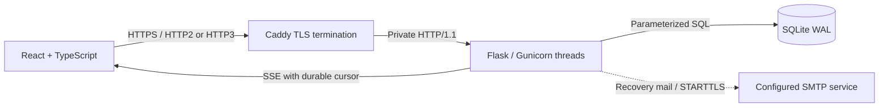
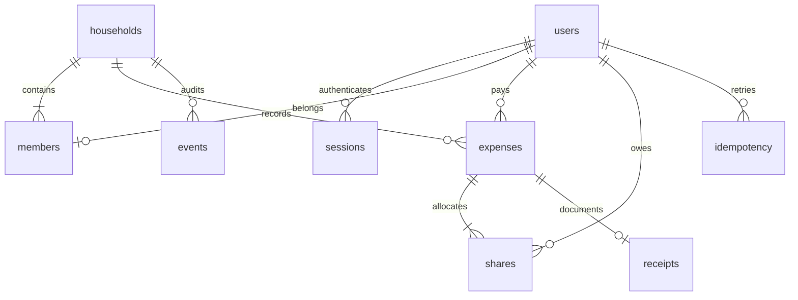
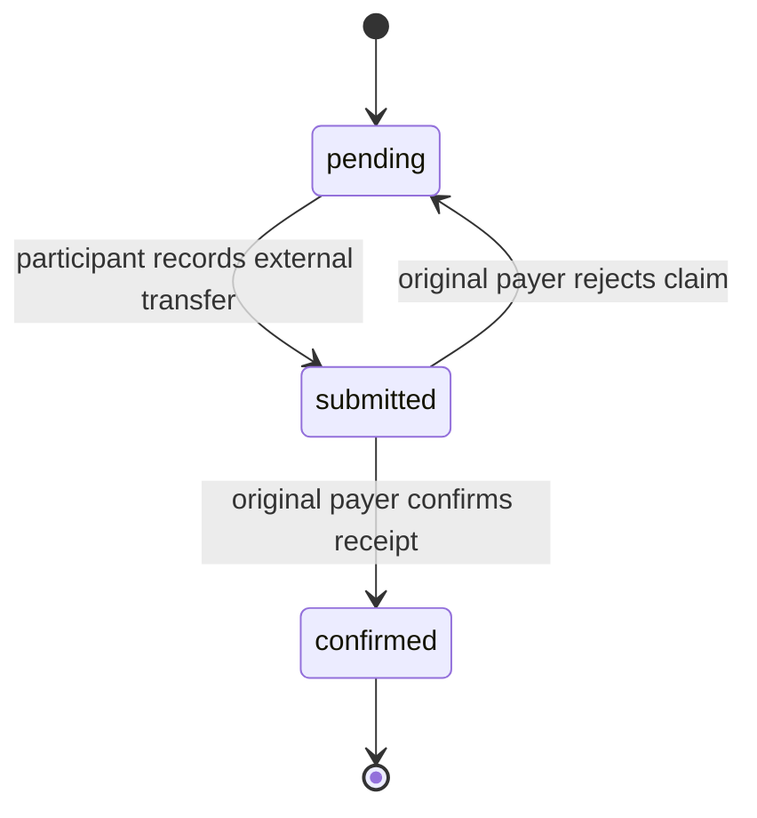

# Architecture

Commonroom is a same-origin React/TypeScript client and Flask JSON API. SQLite is the source of truth for household membership, expenses, shares, sessions, receipts, audit events, request idempotency, and stream leases.

All static assets, icons, and fonts are served locally. No analytics or third-party runtime scripts are loaded. The local server uses Waitress, so the documented source workflow works on Windows and Unix. The Linux container uses Gunicorn with one worker and 24 threads.

## Data model

A user currently belongs to one household. Each household supports up to 12 people and uses GBP. Household ownership controls invitations; expense ownership controls payment confirmations. There is no cross-household administrative role.

`server/migrations/` contains ordered SQL migrations. `PRAGMA user_version` tracks the schema version. Migration scripts execute transactionally. Apply migrations with only one application startup process; do not deploy multiple independent initializers against the same database.

## Monetary invariants

1. Amounts are positive integer pennies, capped at £1,000,000 per expense.
2. Shares sum exactly to the original expense amount.
3. Weighted splitting uses integer quotients and largest remainders. Ties are resolved by ascending user ID, so the result is reproducible.
4. The original payer's own share is immediately confirmed; zero-penny shares are confirmed too.
5. Outstanding net balances across the household sum to zero.
6. Published amounts are immutable. Archiving is allowed only after every share is confirmed and never deletes evidence or audit history.

For example, £10.01 shared equally by four people yields £2.51, £2.50, £2.50, £2.50. No binary floating-point arithmetic is used in backend allocation or storage. The UI accepts a decimal string, splits pounds and pennies, and sends the integer amount.

## Payment state machine

The server validates role and current state inside a write transaction. Repeating a request whose target state has already been reached is a no-op. Confirmation is the terminal state; the app does not support partial transfers or reversing a confirmed payment.

Suggested transfers are computed using a greedy debtor/creditor matching algorithm. It produces at most `n-1` transfers for `n` nonzero participants and preserves net balances, but does not promise the globally minimum transfer count. These transfers are not executable payment instructions and are not automatically reconciled against original shares.

## Retry safety and concurrency

Expense creation requires an `Idempotency-Key`. The key, canonical payload fingerprint, and original response are stored together with the new expense and its audit event. The same user/key/payload returns the first response. Different content under the same key returns 409.

`BEGIN IMMEDIATE` reserves the writer before checking invariants. SQLite serializes writers, while WAL lets readers continue. A five-second busy timeout bounds contention; exhausted database operations return 503. No database transaction stays open while streaming events or sending email. Idempotency keys are retained indefinitely; deployment retention policy is a future concern.

## Audit design

Each event includes household ID, actor ID, action, canonical JSON payload, timestamp, previous hash, and a keyed SHA-256 digest. Appending the event inside the expense/payment transaction prevents a successful domain mutation without its event. A reserved SQLite writer prevents competing appends from creating two chain heads.

Verification recomputes the entire household chain in order. The response displays the most recent 100 events while checking all events. The chain is tamper-evident within the trust assumptions documented in [SECURITY.md](../SECURITY.md); it is not an immutable external ledger.

## Boundaries

- **Single host, modest workload.** SQLite and thread-based SSE are straightforward to run and inspect. Production capacity has not been benchmarked. Larger deployments should move to PostgreSQL and a shared pub/sub-backed asynchronous event service.
- **Bounded streams.** Two leases per account and sixteen overall leave room in the 24-thread server for regular requests. The 25-second stream closes voluntarily and the browser reconnects after three seconds. This introduces a small reconnect gap, recovered by event replay.
- **Snapshot loading.** The workspace endpoint loads the household ledger and verifies the full chain. This prioritizes clarity for small households over arbitrarily large histories. Cursor pagination and incremental verification are future work.
- **Recovery email.** Delivery is synchronous with a ten-second SMTP timeout. A durable outbox and worker would improve availability and reduce timing differences.
- **No financial integrations.** Bank transfers, payments, identity checks, and automatic reconciliation are outside this application.
- **No deployed service implied.** The repository includes reproducible local and HTTPS deployment configurations; a public hosting URL is a separate operational choice.

## Reading the code

Start with `server/ledger.py` for pure accounting rules, `server/security.py` for authentication and guards, and `server/api.py` for transaction boundaries. `web/src/App.tsx` composes the workspace views; authentication, expense dialogs, networking, shared UI, types, and HTTP helpers live in separate modules.
